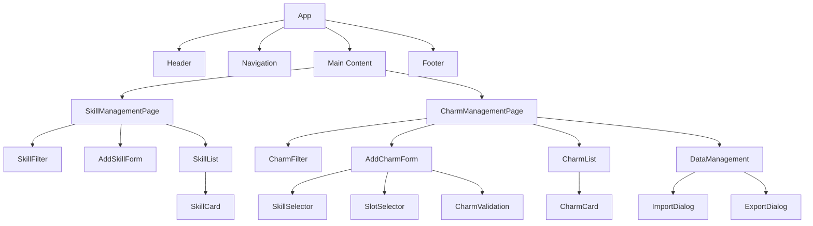
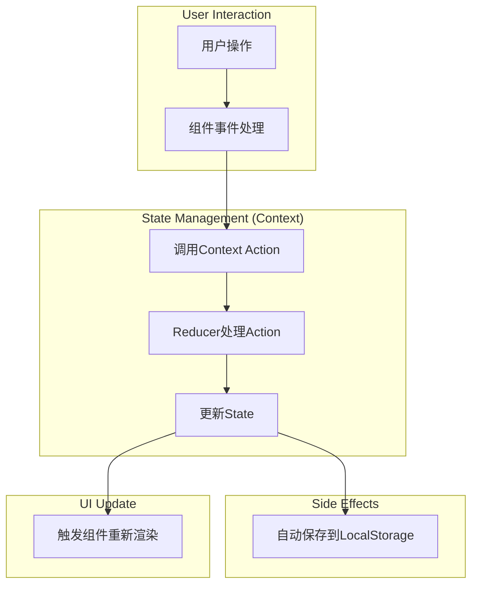
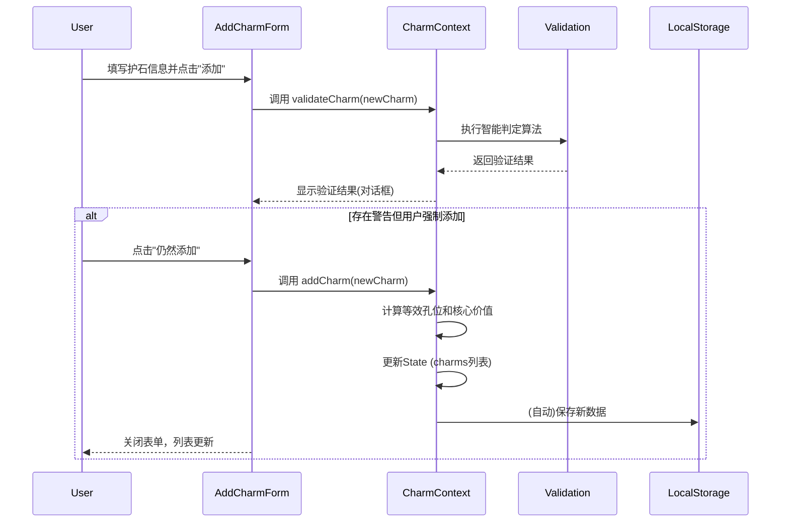

# MHWS护石管理器 - 技术架构设计文档

## 1. 项目概述

### 1.1 项目目标

MHWS护石管理器是一个用于管理《怪物猎人：荒野》(Monster Hunter Wilds)护石的Web应用。该应用帮助玩家高效管理和评估护石，通过智能算法计算等效孔位和核心技能价值，辅助玩家做出最优的护石选择决策。

### 1.2 核心功能

1. **技能管理**：添加、编辑、筛选和排序技能数据
2. **护石管理**：添加、查看、筛选和排序护石数据
3. **智能评估**：自动计算等效孔位和核心技能价值
4. **智能判定**：检测新护石是否优于现有护石
5. **数据持久化**：支持本地存储、导入和导出功能

### 1.3 业务规则

- 护石必须包含1-3个技能，可以有0-3个孔位
- 每个技能有独立的装饰品等级配置
- 等效孔位计算规则：技能按其装饰品等级换算为对应的孔位数量
- 等效核心技能计算规则：武器孔位1/2/3级=1/2/3个核心技能，防具孔位2/3级=1个核心技能
- 护石添加时执行智能判定：检测是否落后于现有护石或低于平均水平

---

## 2. 技术栈详细说明

### 2.1 前端框架

- **React 18.x + TypeScript**
  - 选择理由：组件化开发、强类型支持、生态成熟
  - 使用函数组件 + Hooks模式
  - 严格的TypeScript类型定义

### 2.2 UI框架

- **Tailwind CSS**
  - 选择理由：快速开发、高度可定制、性能优秀
  - 使用JIT模式提升开发体验
- **shadcn/ui**
  - 选择理由：基于Radix UI的高质量组件库、支持主题定制
  - 主要使用组件：Button, Input, Select, Card, Table, Dialog, Badge等

### 2.3 状态管理

- **React Context API + useReducer**
  - 选择理由：原生支持、无需额外依赖、适合中等复杂度应用
  - 全局状态包括：技能数据、护石数据、UI状态

### 2.4 数据存储

- **LocalStorage（主存储）**
  - 存储技能和护石的完整数据
  - 支持离线访问
- **导入/导出功能**
  - 支持JSON文件的导入和导出
  - 便于数据备份和迁移

### 2.5 构建工具

- **Vite**
  - 选择理由：快速的冷启动、热更新、优化的打包
  - ESM原生支持

### 2.6 开发工具

- **ESLint + Prettier**：代码规范和格式化
- **TypeScript Strict Mode**：严格的类型检查

---

## 3. 项目结构设计

```
mhws-charm-manager/
├── public/                          # 静态资源
│   ├── armor-slot-1.png             # 防具孔位1级图标
│   ├── armor-slot-2.png             # 防具孔位2级图标
│   ├── armor-slot-3.png             # 防具孔位3级图标
│   ├── armor.png                    # 防具类型图标
│   ├── charm.png                    # 护石图标
│   ├── special.png                  # 特殊技能图标
│   ├── weapon-slot-1.png            # 武器孔位1级图标
│   ├── weapon-slot-2.png            # 武器孔位2级图标
│   ├── weapon-slot-3.png            # 武器孔位3级图标
│   └── weapon.png                   # 武器技能图标
├── src/
│   ├── components/                  # React组件
│   │   ├── charms/                  # 护石管理组件
│   │   ├── common/                  # 通用组件
│   │   ├── data/                    # 数据管理组件
│   │   ├── layout/                  # 布局组件
│   │   ├── skills/                  # 技能管理组件
│   │   └── ui/                      # UI库组件（shadcn/ui）
│   ├── contexts/                    # React Context
│   ├── data/                        # 初始数据
│   ├── hooks/                       # 自定义Hooks
│   ├── lib/                         # 工具库
│   ├── types/                       # TypeScript类型定义
│   ├── utils/                       # 工具函数
│   ├── App.css                      # 应用样式
│   ├── App.tsx                      # 应用主组件
│   ├── index.css                    # 全局样式
│   └── main.tsx                     # 应用入口
├── .eslintrc.json                   # ESLint配置
├── components.json                  # shadcn/ui配置
├── index.html                       # HTML模板
├── package.json                     # 项目依赖
├── ... (其他配置文件)
└── README.md                        # 项目说明
```

---

## 4. 数据模型设计

### 4.1 核心数据类型

#### 4.1.1 技能类型 (SkillType)

技能的分类，是一个字符串枚举，包含：

- `weapon`: 武器技能
- `armor`: 防具技能
- `special`: 特殊技能

#### 4.1.2 孔位 (Slot)

定义了护石上的物理孔位。每个孔位包含 `type` (类型, `weapon` 或 `armor`) 和 `level` (等级, 1-3级)。

#### 4.1.3 技能 (Skill & SkillWithLevel)

- **Skill**: 定义了一个技能的基础属性，包括`id`, `name`, `type`, `maxLevel` (最高等级), `decorationLevel` (镶嵌所需孔位等级, -1表示无法镶嵌), 和 `isKey` (是否核心技能)。
- **SkillWithLevel**: 表示护石上带有的一个具体技能实例，包含 `skillId` (关联到`Skill`定义) 和 `level` (当前等级)。

#### 4.1.4 护石 (Charm)

定义了护石的核心数据结构，包含 `id`, `rarity` (稀有度), `skills` (技能列表), 和 `slots` (物理孔位列表)。
此外，它还包含两个重要的计算属性：

- **equivalentSlots**: 一个统计各种等效孔位数量的对象（如`weaponSlot1`, `armorSlot2`等）。
- **keySkillValue**: 核心技能价值，一个量化护石强度的数值。

### 4.2 应用状态类型

#### 4.2.1 技能状态

管理技能列表的UI状态，包括筛选条件 (`SkillFilter`)、排序字段 (`SkillSortBy`)。筛选条件支持按类型、是否核心技能、名称搜索。

#### 4.2.2 护石状态

管理护石列表的UI状态，包括筛选条件 (`CharmFilter`)、排序字段 (`CharmSortBy`)。筛选条件支持按稀有度、技能、核心价值等。排序字段包括核心价值、稀有度、各类等效孔位数量等。

#### 4.2.3 验证结果类型

定义了新护石添加时的验证结果。`CharmValidationStatus` 是一个枚举，表示多种验证状态（如 `ACCEPTED`、`REJECTED_AS_INFERIOR` 等）。`CharmValidationResult` 包含最终是否有效 (`isValid`)、具体状态 (`status`) 以及相关的警告信息或用于对比的更优护石。

### 4.3 存储数据结构

定义了保存在 `LocalStorage` 中的顶层数据结构，主要包含：

- `version`: 数据版本号，用于未来的数据迁移。
- `skills`: 技能定义的完整列表。
- `charms`: 用户存储的护石完整列表。
- `lastUpdated`: 最后更新的时间戳。

---

## 5. 核心算法说明

### 5.1 等效孔位计算算法

**算法说明**
将护石的所有技能和物理孔位统一转换为标准化的“等效孔位”，以便进行价值评估。

**算法逻辑**

```pseudocode
function calculateEquivalentSlots(charm, skillsMap):
  // 1. 初始化一个包含所有孔位类型、数量为0的结果对象
  result = { weaponSlot1: 0, ..., armorSlot3: 0 }

  // 2. 累加护石自带的物理孔位
  for each slot in charm.slots:
    result[slot.type + slot.level]++

  // 3. 累加各技能转换的等效孔位
  for each skill_instance in charm.skills:
    skill_definition = skillsMap.get(skill_instance.id)
    slot_type = skill_definition.decoration_type
    slot_level = skill_definition.decoration_level
    // 技能的每个等级都算作一个对应等级的孔位
    slot_count = skill_instance.level 
    result[slot_type + slot_level] += slot_count

  return result
```

### 5.2 等效核心技能计算算法

**算法说明**
基于等效孔位，计算护石的核心技能价值。不同类型的孔位对核心技能的贡献值不同。

**算法逻辑**

```pseudocode
function calculateCoreSkillValue(equivalentSlots, skills, skillsMap):
  value = 0

  // 1. 累加武器孔位的价值
  value += equivalentSlots.weaponSlot1 * 1
  value += equivalentSlots.weaponSlot2 * 2
  value += equivalentSlots.weaponSlot3 * 3

  // 2. 累加防具孔位的价值 (1级孔位价值为0)
  value += equivalentSlots.armorSlot2 * 1
  value += equivalentSlots.armorSlot3 * 1

  // 3. 扣除非核心技能所占用的孔位价值
  for each skill in skills:
    skill_definition = skillsMap.get(skill.id)
    if skill_definition is not a core skill:
      // 根据技能的装饰品类型和等级，计算应扣除的价值
      deduction = calculate_deduction_for_skill(skill)
      value -= deduction

  return max(0, value) // 价值不能为负
```

### 5.3 护石智能判定算法

**算法说明**
在添加新护石时，与现有护石进行比较，判断其是否值得保留。

**算法逻辑**

```pseudocode
function validateNewCharm(newCharm, existingCharms):
  // 1. 检查是否存在一个已有的护石，在所有方面都优于或等于新护石
  for each existingCharm in existingCharms:
    if isInferior(newCharm, existingCharm):
      // 如果新护石完全被现有护石碾压，则直接拒绝
      return REJECTED_AS_INFERIOR, with betterCharm=existingCharm

  // 2. 检查新护石是否完全优于某些已存在的护石
  outclassedCharms = find all charms that are inferior to newCharm
  
  // 3. (可选) 检查新护石的价值是否远低于平均水平，给出警告

  // 4. 如果通过所有检查，则接受
  return ACCEPTED, with optional warnings and list of outclassedCharms

function isInferior(charmA, charmB):
  // 综合比较 charmA 和 charmB 的技能和所有等效孔位
  // 如果 B 在所有方面都优于或等于 A (且至少有一方面更优)，则 A is inferior to B
  skills_are_worse = ...
  slots_are_worse = ...
  return skills_are_worse AND slots_are_worse
```

---

## 6. 组件架构设计

### 6.1 组件层级图



### 6.2 核心组件职责

- **Skill/CharmManagementPage**: 技能和护石管理的主页面，整合了筛选、列表、添加等功能。
- **Skill/CharmList**: 展示数据列表，支持排序。
- **Skill/CharmCard**: 以卡片形式展示单个技能或护石的详细信息。
- **AddCharmForm**: 添加护石的表单，是应用中最复杂的表单，内部集成了`SkillSelector`等子组件。
- **SkillSelector**: 一个可复用的组件，允许用户通过搜索从列表中选择技能，并设置其等级。
- **CharmValidation**: 根据智能判定算法的结果，向用户显示警告或确认信息，并允许用户决定是否继续添加。
- **DataManagement**: 负责数据导入和导出的组件，通常包含触发导入/导出功能的按钮。

---

## 7. 数据流设计

### 7.1 状态管理架构

本应用使用 React Context API 进行状态管理，主要分为两个独立的 Context：

- **SkillContext**: 负责管理全局的技能数据（增删改查）、筛选和排序状态。
- **CharmContext**: 负责管理全局的护石数据、筛选和排序状态。同时，核心的护石计算和验证逻辑也封装在此。

两个 Context 都通过 `useEffect` Hooks 实现了与 `LocalStorage` 的自动同步。当状态变更时，数据会被写入本地存储；应用加载时，会从本地存储恢复数据。

### 7.2 数据流图



### 7.3 关键数据流程：添加护石



---

## 8. 文件存储方案

### 8.1 LocalStorage存储

应用的主要数据（技能和护石列表）以单一JSON对象的形式，存储在浏览器的`LocalStorage`中。我们封装了`load`, `save`, `clear`等原子操作函数。加载时会进行基本的数据格式校验，以确保数据安全。

### 8.2 JSON文件格式

用于导入/导出的JSON文件有统一的结构，包含`version`元数据和`skills`/`charms`数组。

- **导出**: 读取`LocalStorage`中的完整数据，生成一个带时间戳的`mhws-charm-data-*.json`文件供用户下载。
- **导入**: 读取用户选择的JSON文件，在通过格式验证后，用文件中的数据覆盖`LocalStorage`和当前应用状态。

### 8.3 初始化数据

当应用首次启动且`LocalStorage`中没有数据时，系统会自动创建一组初始数据（如默认技能），为用户提供基础的配置，避免冷启动时列表为空。

---

## 9. 扩展性设计

### 9.1 预留的扩展接口

为未来的功能迭代，当前架构预留了清晰的扩展点，但未提供具体实现。

- **护石搭配推荐**: 预留了根据用户期望技能来推荐护石组合的接口。未来可以实现配装器算法。
- **多语言支持**: 预留了加载不同语言包、切换应用语言的接口。
- **云端同步**: 预留了与云服务同步数据的接口（如登录后将数据备份到云端）。

### 9.2 数据迁移策略

设计了一个数据迁移管理器(`DataMigrationManager`)。当未来数据结构发生不兼容变更时（如v1.0.0 -> v2.0.0），可以注册版本间的迁移脚本。应用启动时，若检测到旧版本数据，管理器会自动、顺序地执行相应的迁移脚本，将数据安全地升级到最新版本，以保证良好的向后兼容性。

---

## 10. 性能优化策略

### 10.1 组件优化

- 使用 `React.memo` 包装纯组件，避免不必要的重渲染。
- 对复杂计算结果使用 `useMemo` 进行缓存。
- 对传递给子组件的回调函数使用 `useCallback` 来稳定其引用。
- 当护石列表过长时，考虑使用虚拟滚动（如`react-window`）来优化长列表的渲染性能。

### 10.2 数据处理优化

- 将技能列表转换为 `Map` 结构进行存储，使得按ID查找技能的时间复杂度从 `O(n)` 降为 `O(1)`。
- 护石的等效孔位和核心技能价值在添加时一次性计算并存储，避免在渲染或排序时重复计算。

---

## 11. 安全性考虑

### 11.1 数据验证

- **输入验证**: 对所有用户输入（特别是导入的JSON文件）进行严格的格式和类型验证，防止格式错误的数据污染应用状态。
- **防XSS**: 依赖React的自动JSX转义机制来防止跨站脚本攻击。

### 11.2 错误处理

通过React的`ErrorBoundary`组件实现全局错误捕获。当UI渲染过程中发生未被捕获的JavaScript错误时，该组件可以捕获错误、记录日志，并展示一个优雅的降级UI，从而防止整个应用白屏崩溃。

---

## 附录

### A. 术语表

- **护石（Charm）**：游戏中的装备道具，提供技能和孔位
- **技能（Skill）**：护石或装备提供的能力
- **孔位（Slot）**：可以镶嵌装饰品的位置
- **装饰品（Decoration）**：镶嵌在孔位中，提供技能
- **等效孔位（Equivalent Slots）**：将技能换算为孔位数量的结果
- **核心技能（Core Skill）**：最有价值的技能
- **等效核心技能价值（Core Skill Value）**：基于孔位计算的核心价值

### CHANGELOG

- **v0.0.0 (2025-10-12)**：初始架构设计文档
- **v0.6.2 (2025-10-20)**: 简化架构设计文档
