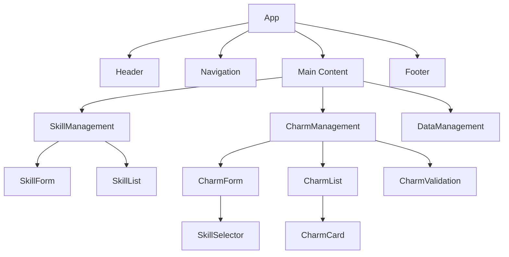
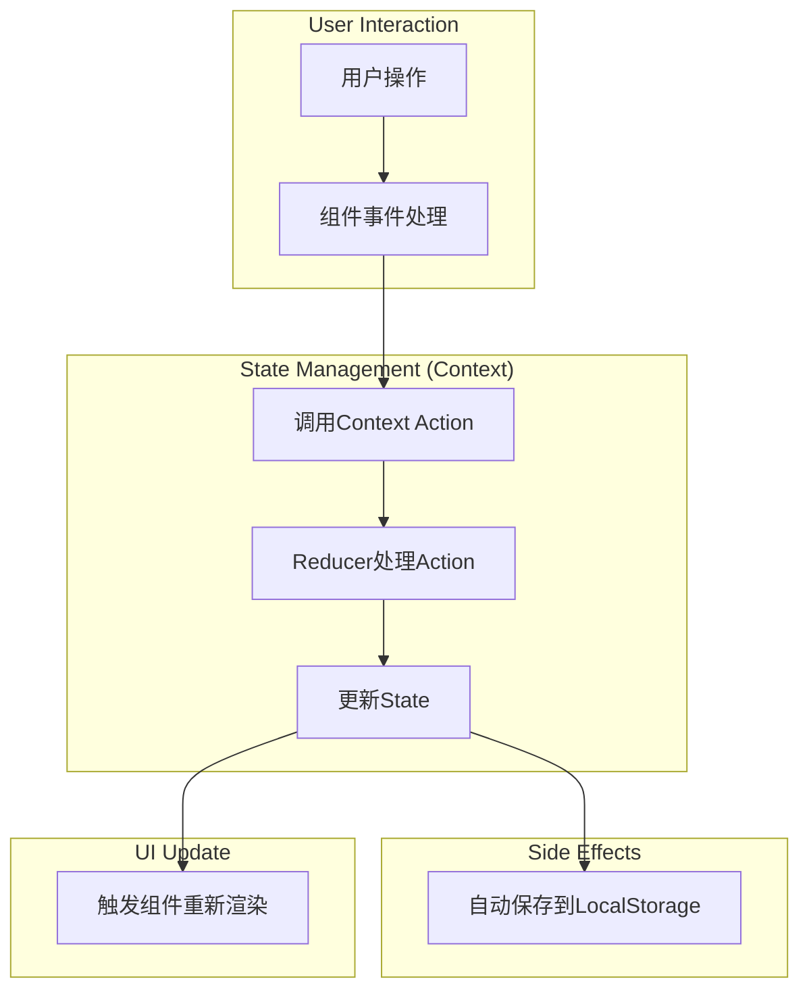
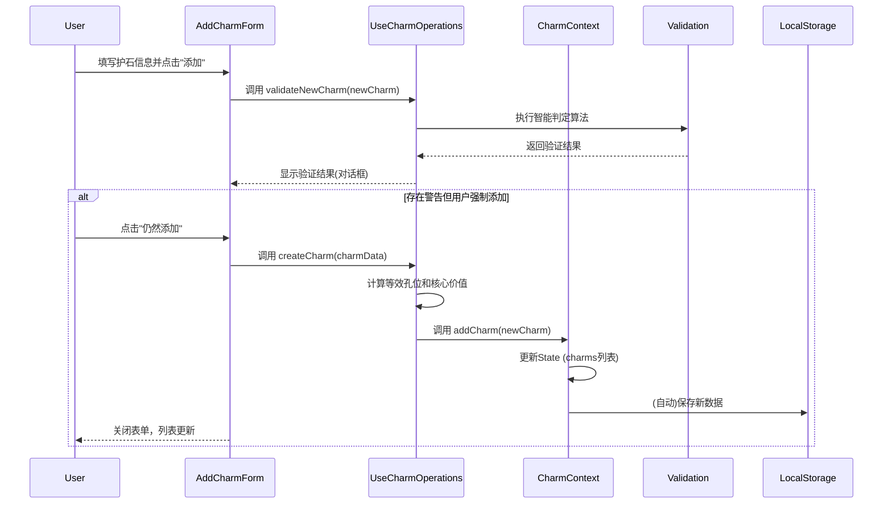

# MHWS护石管理器 - 技术架构设计文档

## 1. 项目概述

### 1.1 项目目标

MHWS护石管理器是一个用于管理《怪物猎人：荒野》(Monster Hunter Wilds)护石的Web应用。该应用帮助玩家高效管理和评估护石，通过智能算法计算等效孔位和核心技能价值，辅助玩家做出最优的护石选择决策。

### 1.2 核心功能

1. **技能管理**：添加、编辑、筛选和排序技能数据
2. **护石管理**：添加、查看、筛选和排序护石数据
3. **智能评估**：自动计算等效孔位和核心技能价值
4. **智能判定**：检测新护石是否优于现有护石
5. **数据持久化**：支持本地存储、导入和导出功能

### 1.3 业务规则

- 护石必须包含1-3个技能，可以有0-3个孔位
- 每个技能有独立的装饰品等级配置
- 等效孔位计算规则：技能的 **每个等级** 都会换算为一个其装饰品等级对应的孔位。
- 核心技能价值计算规则：武器孔位1/2/3级分别等价于 **1/2/3点价值**，防具孔位2/3级等价于 **1点价值**。
- 护石添加时执行智能判定：检测是否落后于现有护石或低于平均水平

---

## 2. 技术栈详细说明

### 2.1 前端框架

- **React 19.1.1 + TypeScript ~5.9.3**
  - 选择理由：组件化开发、强类型支持、生态成熟
  - 使用函数组件 + Hooks模式
  - 严格的TypeScript类型定义

### 2.2 UI框架

- **Tailwind CSS 4.1.14**
  - 选择理由：快速开发、高度可定制、性能优秀
  - 使用JIT模式提升开发体验
- **shadcn/ui**
  - 选择理由：基于Radix UI的高质量组件库、支持主题定制
  - 主要使用组件：Button, Input, Select, Card, Table, Dialog, Badge等

### 2.3 状态管理

- **React Context API + useReducer**
  - 选择理由：原生支持、无需额外依赖、适合中等复杂度应用
  - 全局状态包括：技能数据、护石数据、UI状态

### 2.4 数据存储

- **LocalStorage（主存储）**
  - 存储技能和护石的完整数据
  - 支持离线访问
- **导入/导出功能**
  - 支持JSON文件的导入和导出
  - 便于数据备份和迁移

### 2.5 构建工具

- **Vite 7.1.7**
  - 选择理由：快速的冷启动、热更新、优化的打包
  - ESM原生支持

### 2.6 开发工具

- **ESLint 9.36.0**：代码规范检查
- **TypeScript Strict Mode**：严格的类型检查

---

## 3. 项目结构设计

```bash
mhws-charm-manager/
├── public/                          # 静态资源
├── scripts/                         # 构建和数据生成脚本
│   └── generate-skills-json.ts      # 官方技能数据生成脚本
├── src/
│   ├── components/                  # React组件
│   │   ├── charms/                  # 护石管理组件
│   │   ├── common/                  # 通用组件
│   │   ├── dm/                      # 数据管理组件
│   │   ├── layout/                  # 布局组件
│   │   ├── skills/                  # 技能管理组件
│   │   └── ui/                      # UI库组件（shadcn/ui）
│   ├── contexts/                    # React Context
│   ├── data/                        # 初始数据
│   ├── hooks/                       # 自定义Hooks
│   ├── lib/                         # 工具库
│   ├── types/                       # TypeScript类型定义
│   ├── utils/                       # 工具函数
│   ├── App.css                      # 应用样式
│   ├── App.tsx                      # 应用主组件
│   ├── index.css                    # 全局样式
│   └── main.tsx                     # 应用入口
├── .eslintrc.json                   # ESLint配置
├── components.json                  # shadcn/ui配置
├── index.html                       # HTML模板
├── package.json                     # 项目依赖
├── ... (其他配置文件)
└── README.md                        # 项目说明
```

---

## 4. 数据模型设计

### 4.1 核心数据类型

#### 4.1.1 技能类型 (SkillType)

技能的分类，是一个字符串枚举，包含：

- `weapon`: 武器技能
- `armor`: 防具技能
- `series`: 套装技能
- `group`: 组合技能

#### 4.1.2 孔位类型和等级 (SlotType, SlotLevel)

- **SlotType**: 孔位类型枚举，包含 `weapon` (武器孔位) 和 `armor` (防具孔位)。
- **SlotLevel**: 孔位等级枚举，包含 `-1` (无装饰品)，`1` (1级)，`2` (2级)，`3` (3级)。

#### 4.1.3 孔位 (Slot)

定义了护石上的孔位。每个孔位包含 `type` (类型, `SlotType`) 和 `level` (等级, `SlotLevel`)。

#### 4.1.4 技能 (Skill & SkillWithLevel)

- **Skill**: 定义了一个技能的基础属性，包括：
  - `id`: 技能唯一标识符
  - `name`: 技能名称
  - `type`: 技能类型 (`SkillType`)
  - `maxLevel`: 最高等级
  - `decorationLevel`: 镶嵌所需孔位等级 (`SlotLevel`, -1表示无法镶嵌)
  - `isKey`: 是否为核心技能
  - `description`: 技能描述
  - `skillIconType`: 技能图标类型
  - `sortId`: 排序ID
- **SkillWithLevel**: 表示护石上带有的一个具体技能实例，包含 `skillId` (关联到`Skill`定义) 和 `level` (当前等级)。

#### 4.1.5 等效孔位 (EquivalentSlots)

用于统计护石技能和孔位转换后的等效孔位数量的对象，包含：

- `weaponSlot1`: 1级武器孔位数量
- `weaponSlot2`: 2级武器孔位数量
- `weaponSlot3`: 3级武器孔位数量
- `armorSlot1`: 1级防具孔位数量
- `armorSlot2`: 2级防具孔位数量
- `armorSlot3`: 3级防具孔位数量

#### 4.1.6 护石 (Charm)

定义了护石的核心数据结构，包含：

- `id`: 护石唯一标识符
- `rarity`: 稀有度 (1-12)
- `skills`: 技能列表
- `slots`: 孔位列表
- `equivalentSlots`: 等效孔位
- `keySkillValue`: 核心技能价值
- `createdAt`: 创建时间 (ISO 8601格式)

### 4.2 应用状态类型

#### 4.2.1 护石验证状态 (CharmValidationStatus)

定义了新护石添加时的验证状态枚举，包括：

- `ACCEPTED_AS_FIRST`: 数据库为空，直接接受
- `ACCEPTED_BY_MAX_VALUE`: 因核心价值最高而快速接受
- `ACCEPTED_BY_MAX_SLOTS`: 因等效孔位最高而快速接受
- `ACCEPTED_AS_UNIQUE_SKILL`: 因拥有独特的核心/高级技能而接受
- `ACCEPTED`: 通过详细比较后接受
- `REJECTED_AS_INFERIOR`: 因存在绝对更优的护石而被拒绝

#### 4.2.2 护石验证结果 (CharmValidationResult)

包含验证结果的完整信息：`isValid` (是否通过验证), `status` (验证状态), `warnings` (可选警告消息), `betterCharm` (更优护石), `outclassedCharms` (被完爆的护石列表)。

#### 4.2.3 护石排序字段 (CharmSortField)

定义了护石列表的排序字段枚举，包括：

- `keySkillValue`: 核心技能价值
- `rarity`: 稀有度
- `createdAt`: 创建时间
- `weaponSlot1/2/3`: 武器孔位1/2/3级数量
- `armorSlot1/2/3`: 防具孔位1/2/3级数量

#### 4.2.4 排序方向 (SortDirection)

定义了排序方向枚举：`asc` (升序) 和 `desc` (降序)。

### 4.3 存储数据结构

定义了保存在 `LocalStorage` 中的顶层数据结构，主要包含：

- `version`: 数据版本号，用于未来的数据迁移。
- `skills`: 技能定义的完整列表。
- `charms`: 用户存储的护石完整列表。

---

## 5. 核心算法说明

### 5.1 等效孔位计算算法

- 将护石的所有技能和物理孔位统一转换为标准化的"等效孔位"，以便进行价值评估。技能按照其装饰品等级换算为对应类型的等效孔位。

```pseudocode
function calculateCharmEquivalentSlots(skills, slots, skillsData):
  // 1. 初始化结果对象
  totalEquivalentSlots = { ... }

  // 2. 累加技能的等效孔位
  for each skill_instance in skills:
    skill_def = skillsData.get(skill_instance.id)
    if skill_def is valid:
      // 技能的每个等级都算作一个对应装饰品等级的孔位
      slot_key = skill_def.type + "Slot" + skill_def.decorationLevel
      totalEquivalentSlots[slot_key] += skill_instance.level

  // 3. 累加护石自身的孔位
  for each slot in slots:
    slot_key = slot.type + "Slot" + slot.level
    totalEquivalentSlots[slot_key] += 1

  return totalEquivalentSlots
```

### 5.2 等效核心技能计算算法

- 直接计算护石的核心技能价值，不基于等效孔位。核心技能价值是核心技能等级的总和加上孔位价值的累加。

```pseudocode
function calculateKeySkillValue(skills, slots, skillsData):
  value = 0

  // 1. 累加核心技能等级
  for each skill_instance in skills:
    if skill_instance is a core skill:
      value += skill_instance.level

  // 2. 累加孔位价值
  for each slot in slots:
    if slot.type === 'weapon':
      value += slot.level // 1/2/3级孔位价值为 1/2/3
    else if slot.type === 'armor' and slot.level >= 2:
      value += 1 // 2/3级孔位价值为 1

  return value
```

### 5.3 护石智能判定算法

- 在添加新护石时，与现有护石进行多阶段比较，判断其是否值得保留。包括完爆检查、价值评估和独特技能检测。

```pseudocode
function validateCharm(newCharm, existingCharms):
  // Phase 0: 数据库为空，直接接受
  if existingCharms.length === 0:
    return { isValid: true, status: 'ACCEPTED_AS_FIRST' }

  // Phase 1: 完爆检查 (Dominance Check)
  // 1.1: 检查新护石是否被任何现有护石完爆（绝对劣势）
  for each existingCharm in existingCharms:
    if isDominating(existingCharm, newCharm):
      return { isValid: false, status: 'REJECTED_AS_INFERIOR', betterCharm: existingCharm }

  // 1.2: 检查新护石完爆了哪些现有护石（绝对优势）
  outclassedCharms = existingCharms.filter(existingCharm => isDominating(newCharm, existingCharm))

  // Phase 2: 确定接受理由 (Acceptance Status)
  status = 'ACCEPTED'
  
  if newCharm.keySkillValue > max(existingCharms.keySkillValue):
    status = 'ACCEPTED_BY_MAX_VALUE'
  else if newCharm.equivalentSlots is strictly superior to max(existingCharms.equivalentSlots):
    status = 'ACCEPTED_BY_MAX_SLOTS'
  else:
    // 检查是否拥有独特技能（核心技能优先，其次是最高等级技能）
    if newCharm has unique core/max-level skill not present in existingCharms:
      status = 'ACCEPTED_AS_UNIQUE_SKILL'

  // Phase 3: 生成警告 (Warning Generation)
  if newCharm.keySkillValue < average(existingCharms.keySkillValue) - KEY_SKILL_VALUE_THRESHOLD:
    warnings.add("核心价值明显低于平均值")

  // Phase 4: 返回结果
  return { isValid: true, status, warnings, outclassedCharms }

function isDominating(dominator, dominated):
  // 1. 检查 dominator 的等效孔位是否优于或等于 dominated
  slotComparison = compareEquivalentSlots(dominator.equivalentSlots, dominated.equivalentSlots)
  if slotComparison === 'inferior':
    return false

  // 2. 检查 dominator 是否覆盖 dominated 的所有技能，且等级不低于对方
  // 3. 必须至少有一项（孔位或技能）严格更优
  return (slotComparison === 'superior') or (dominator.skills are strictly superior to dominated.skills)
```

---

## 6. 组件架构设计

### 6.1 组件层级图



### 6.2 核心组件职责

- **SkillManagement**: 技能管理主组件，整合了技能表单、列表等功能，支持添加、编辑、删除技能。
- **CharmManagement**: 护石管理主组件，整合了护石表单、列表、验证等功能，支持添加、编辑、删除护石。
- **DataManagement**: 数据管理主组件，负责数据导入、导出和重置功能，包含JSON和CSV导出选项。
- **SkillList**: 以表格形式展示技能列表，支持筛选、排序、分页和删除操作。
- **CharmList**: 以表格形式展示护石列表，支持复杂的筛选（稀有度、核心价值、技能）、排序、分页和编辑操作。
- **CharmCard**: 以卡片形式展示单个护石的详细信息，包括技能、孔位和等效价值。
- **CharmForm**: 添加/编辑护石的表单组件，包含技能选择器和孔位配置，是应用中最复杂的表单。
- **CharmValidation**: 根据智能判定算法的结果，以弹出窗口形式显示验证状态、警告信息和确认选项。
- **SkillSelector**: 一个可复用的组件，允许用户通过搜索从技能列表中选择技能，并设置其等级。
- **SkillForm**: 添加/编辑技能的表单组件，支持技能名称、类型、最大等级等属性配置。

---

## 7. 数据流设计

### 7.1 状态管理架构

本应用使用 React Context API 进行状态管理，主要分为两个独立的 Context：

- **SkillContext**: 负责管理全局的技能数据（增删改查）、筛选和排序状态。
- **CharmContext**: 负责管理全局的护石数据、筛选和排序状态。

两个 Context 都通过 `useEffect` Hooks 实现了与 `LocalStorage` 的自动同步。当状态变更时，数据会被写入本地存储；应用加载时，会从本地存储恢复数据。

核心的护石计算和验证逻辑被抽象到 [`useCharmOperations`](src/hooks/useCharmOperations.ts:1) 自定义 Hook 中，该 Hook 封装了护石的创建、验证、更新等复杂操作，并通过 Context Hook 访问技能和护石数据。

### 7.2 数据流图



### 7.3 关键数据流程：添加护石



---

## 8. 文件存储方案

### 8.1 LocalStorage存储

应用的主要数据（技能和护石列表）被分开存储在浏览器的`LocalStorage`中，使用三个独立的键名：

- `mhws-charm-manager-skills`: 存储技能列表的JSON字符串
- `mhws-charm-manager-charms`: 存储护石列表的JSON字符串
- `mhws-charm-manager-version`: 存储数据版本号

我们封装了`saveSkills`、`loadSkills`、`saveCharms`、`loadCharms`、`clearStorage`、`getStorageVersion`等原子操作函数。加载时会进行基本的JSON解析错误处理，以确保数据安全。

### 8.2 JSON文件格式

用于导入/导出的JSON文件有统一的结构，包含`version`、`exportedAt`、`skills`和`charms`字段。

```json
{
  "version": "1.0.0",
  "exportedAt": "2025-10-20T06:00:00.000Z",
  "skills": [...],
  "charms": [...]
}
```

- **导出**: 读取`LocalStorage`中的完整数据，生成一个带日期的`mhws-charms-YYYY-MM-DD.json`文件供用户下载。
- **导入**: 读取用户选择的JSON文件，经格式验证后，用文件中的数据覆盖`LocalStorage`和当前应用状态。导入时会检查必需字段的存在性和数据类型。

### 8.3 初始化数据

当应用首次启动且`LocalStorage`中没有数据时，系统会自动加载官方技能数据，初始护石数据为空列表：

- **技能数据**: 自动加载官方技能库（176个技能），包含完整的技能信息、类型映射和排序规则。
- **护石数据**: 初始为空列表，用户需要自行添加护石。

---

## 9. 扩展性设计

### 9.1 预留的扩展接口 (未来规划)

当前架构设计上预留了清晰的模块边界和接口，以支持未来的功能迭代，但以下功能尚未实现：

- **护石搭配推荐 (尚未实现)**：预留了根据用户期望技能来推荐护石组合的接口。未来可以实现配装器算法。
- **多语言支持 (尚未实现)**：预留了加载不同语言包、切换应用语言的接口。
- **云端同步 (尚未实现)**：预留了与云服务同步数据的接口（如登录后将数据备份到云端）。

### 9.2 数据迁移策略 (已实现)

- **数据迁移管理器 (已实现)**：实现了一个数据迁移系统（[`migration.ts`](src/utils/migration.ts)），在应用启动时自动检测数据版本并执行必要的迁移。当前支持从旧技能系统迁移到官方技能数据，使用技能名称映射确保数据连续性。

---

## 10. 性能优化策略

### 10.1 组件优化 (已实现/未来规划)

- **使用 `useMemo` 进行缓存 (已实现)**：对复杂计算结果（如护石的等效孔位、核心价值、列表筛选和排序结果）使用 `useMemo` 进行缓存，避免在每次渲染时重复计算。
- **使用 `useCallback` 稳定引用 (已实现)**：在 [`useCharmOperations`](src/hooks/useCharmOperations.ts:67) 等 Hooks 中使用了 `useCallback` 来稳定传递给子组件或依赖项列表的函数引用。
- **使用 `React.memo` 包装纯组件 (未来规划)**：**目前代码中尚未广泛使用 `React.memo`**，未来可用于包装纯展示组件，以避免不必要的重渲染。
- **虚拟滚动 (未来规划)**：当护石列表过长时，考虑使用虚拟滚动（如`react-window`）来优化长列表的渲染性能。

### 10.2 数据处理优化 (已实现/待优化)

- **预计算价值 (已实现)**：护石的等效孔位和核心技能价值在添加时（通过 [`useCharmOperations.createCharm()`](src/hooks/useCharmOperations.ts:67)）一次性计算并存储，避免在渲染或排序时重复计算。
- **技能查找优化 (待优化)**：文档中规划将技能列表转换为 `Map` 结构进行存储，使得按ID查找技能的时间复杂度从 `O(n)` 降为 `O(1)`。**目前在核心计算函数中，技能查找仍使用 `Array.prototype.find()`，性能优化尚未完全实现。**

---

## 11. 安全性考虑

### 11.1 数据验证 (已实现)

- **输入验证 (已实现)**：对用户输入（如技能名称）进行了基本的重复性检查 ([`src/contexts/SkillContext.tsx:151`](src/contexts/SkillContext.tsx:151))。导入/导出功能中也包含对JSON文件格式的验证。
- **防XSS (已实现)**：依赖React的自动JSX转义机制来防止跨站脚本攻击。

### 11.2 错误处理 (未来规划)

- **全局错误捕获 (`ErrorBoundary`) (尚未实现)**：文档中规划通过React的`ErrorBoundary`组件实现全局错误捕获。**目前代码中尚未实现此组件**，未来应添加以防止应用白屏崩溃。

---

## 附录

### A. 术语表

- **护石（Charm）**：游戏中的装备道具，提供技能和孔位
- **技能（Skill）**：护石或装备提供的能力
- **孔位（Slot）**：可以镶嵌装饰品的位置
- **装饰品（Decoration）**：镶嵌在孔位中，提供技能
- **等效孔位（Equivalent Slots）**：将技能换算为孔位数量的结果
- **核心技能（Core Skill）**：最有价值的技能
- **等效核心技能价值（Core Skill Value）**：基于孔位计算的核心价值

### CHANGELOG

- **v0.0.0 (2025-10-12)**：初始架构设计文档
- **v0.6.2 (2025-10-20)**: 根据 v0.6.2 的代码实现，对整个架构文档进行了全面的审查和更新。
- **v0.7.0 (2025-10-22)**: 升级数据版本，使用官方技能数据。实现数据迁移逻辑，更新技能数据模型和初始化流程。
